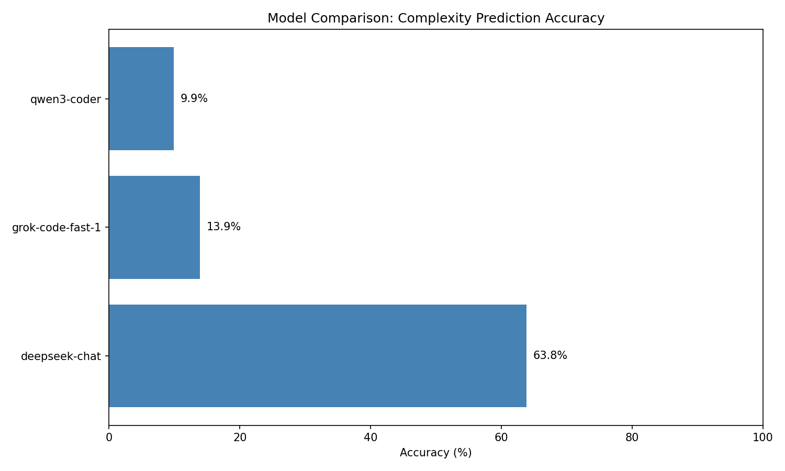

# LLM Complexity Prediction - Experiment Log

## 1. Task Progress

| #   | Task                                                              | Status |
|-----|-------------------------------------------------------------------|--------|
| 1   | Model comparison: Test Qwen Coder 3, DeepSeek, etc. on same dataset | Done   |
| 2   | Data collection script: Build script for teammates to generate datasets | Done   |
| 3   | Accuracy table: Create model vs accuracy comparison table         | Done   |
| 4   | Prompt engineering: Optimize prompts for parallel code complexity | Done   |
| 5   | Study Alexander's script: Learn CUBE parsing and integrate into workflow | Done   |
| 6   | Activation steering: Explore this research direction              | Future |
| 7   | Prepare Jan 15 meeting: Use this markdown as presentation         | Done   |

---

## 2. Experiment Results (Dec 2025)

### 2.1 Model Comparison

**Dataset:** 2348 balanced samples, 77 complexity classes

| Model | Accuracy | Correct/Total |
|-------|----------|---------------|
| deepseek-chat | 63.8% | 1499/2348 |
| x-ai/grok-code-fast-1 | 13.9% | 327/2348 |
| qwen/qwen3-coder | 9.9% | 60/606 |



### 2.2 Sampling Strategy

```
Total dataset: 16,286 samples across 77 complexity classes
Problem: Class imbalance (n^(1) has 10,000+ samples, rare classes have <10)

Strategy: Balanced sampling to ensure all classes represented
┌────────────────────────────────────────────────────────────┐
│ 1. Calculate: min_per_class = total_samples / n_classes    │
│    = 2348 / 77 ≈ 30 samples per class                      │
│                                                            │
│ 2. First pass: Take min(available, 30) from each class     │
│    - Large classes: exactly 30 samples                     │
│    - Small classes: all available samples                  │
│                                                            │
│ 3. Second pass: Distribute remaining quota proportionally  │
│    - Prioritize underrepresented classes                   │
└────────────────────────────────────────────────────────────┘

Result: 77 classes covered, ~30 samples each (where available)
```

### 2.3 Key Findings

- DeepSeek significantly outperforms other models
- Strong on standard complexities: n^(1) → 89.4%, n^(2) → 78.3%
- All models fail on MPI-related complexities (p-terms) → 0%


### 2.4 Prompt Engineering

**Approaches tested:**

| Approach | Result | Notes |
|----------|--------|-------|
| Few-shot prompting | ~40% accuracy | Over-predicted n^(1), worse than zero-shot |
| Zero-shot + full source | Failed | Context limit exceeded (431k tokens) |
| Zero-shot + function extraction | **63.8%** | Extract only relevant functions from call path |

**Current prompt strategy:**
1. Extract function code from call path (not full source file)
2. Zero-shot prompting (no examples)
3. Ask for complexity in terms of `n` (problem size) and `p` (processes)
4. Simple text matching for evaluation

**Why MPI complexities fail (0% accuracy):**
- Expressions like `p^(1/4) * log2(p)^(1)` are empirically derived from Extra-P
- LLM cannot predict hardware/runtime behavior from code alone
- These are measurement-based models, not theoretical complexity

**Future directions:**
- Try structured output (`<complexity>` tags like Alexander's script)
- Fine-tune on parallel code examples
- Combine LLM prediction with Extra-P for validation

---

## 3. Technical Reference

### 3.1 Scripts Workflow

```
┌─────────────────────────────────────────────────────────────────────────────┐
│                           DATA SOURCES                                      │
├─────────────────────────────┬───────────────────────────────────────────────┤
│  Zenodo (.cubex files)      │  Case 2 (.tar.xz archives)                    │
│  - lulesh/                  │  - experiment_1~5.tar.xz                      │
│  - RELeARN/                 │  - Contains call_path.txt, complexity.txt     │
└──────────────┬──────────────┴────────────────────┬──────────────────────────┘
               │                                   │
               ▼                                   ▼
┌──────────────────────────────┐    ┌─────────────────────────────────────────┐
│ 1. process_zenodo_data.py    │    │ 2. generate_dataset.py                  │
│ ─────────────────────────    │    │ ──────────────────────                  │
│ • Parse LULESH .cubex files  │    │ • Extract case_2 data                   │
│ • Parse RELeARN text files   │    │ • Create JSON with ground truth         │
│ • List/explore experiments   │    │ • Split train/val/test                  │
│                              │    │                                         │
│ Status: Exploration tool     │    │ Status: Dataset generator               │
│ (not fully integrated yet)   │    │ (main data source for evaluation)       │
└──────────────────────────────┘    └──────────────┬──────────────────────────┘
                                                   │
                                                   ▼
                                    ┌─────────────────────────────────────────┐
                                    │         data/dataset/                   │
                                    │         ├── train.json                  │
                                    │         ├── val.json                    │
                                    │         └── test.json                   │
                                    └──────────────┬──────────────────────────┘
                                                   │
                                                   ▼
                                    ┌─────────────────────────────────────────┐
                                    │ 3. evaluate_llm.py                      │
                                    │ ──────────────────                      │
                                    │ • Load JSON dataset                     │
                                    │ • Send to LLM (DeepSeek/OpenRouter)     │
                                    │ • Compare prediction vs ground truth    │
                                    │ • Output accuracy results               │
                                    │                                         │
                                    │ Status: Core evaluation engine          │
                                    └──────────────┬──────────────────────────┘
                                                   │
                                                   ▼
                                    ┌─────────────────────────────────────────┐
                                    │ 4. run_comparison.py                    │
                                    │ ────────────────────                    │
                                    │ • Orchestrates evaluate_llm.py          │
                                    │ • Tests multiple models                 │
                                    │ • Balanced sampling across classes      │
                                    │ • Generates charts & summary            │
                                    │                                         │
                                    │ Status: Experiment runner               │
                                    └──────────────┬──────────────────────────┘
                                                   │
                                                   ▼
                                    ┌─────────────────────────────────────────┐
                                    │         results/                        │
                                    │         ├── comparison_summary.json     │
                                    │         └── charts/*.png                │
                                    └─────────────────────────────────────────┘
```

### 3.2 How to Use

```bash
# Step 1: Generate dataset (one-time)
python scripts/generate_dataset.py --case 2 --split --output data/dataset/

# Step 2: Run single model evaluation
python scripts/evaluate_llm.py --provider deepseek --model deepseek-chat \
    --input data/dataset/test.json --output results/deepseek.json

# Step 3: Or run full comparison (calls evaluate_llm.py internally)
python scripts/run_comparison.py --samples 100 --balanced

# Optional: Explore Zenodo data
python scripts/process_zenodo_data.py --list
python scripts/process_zenodo_data.py --parse-lulesh
```

### 3.3 Scripts Summary

| Script | Role | Input | Output |
|--------|------|-------|--------|
| `process_zenodo_data.py` | Explore Zenodo data | .cubex files | Console output |
| `generate_dataset.py` | Create dataset | case_2 archives | JSON files |
| `evaluate_llm.py` | Evaluate one model | JSON + API | Accuracy results |
| `run_comparison.py` | Compare models | JSON + APIs | Summary + charts |

### 3.4 Related: Alexander's CUBE Parser

`callpath_source_excerpt/callpath_code_extraction.py` - Direct CUBE file analysis tool:
- Parses `.cubex` files with `pycubexr`
- Extracts source code along call paths
- Sends to LLM for real-time complexity prediction
- Use for production analysis of new applications
